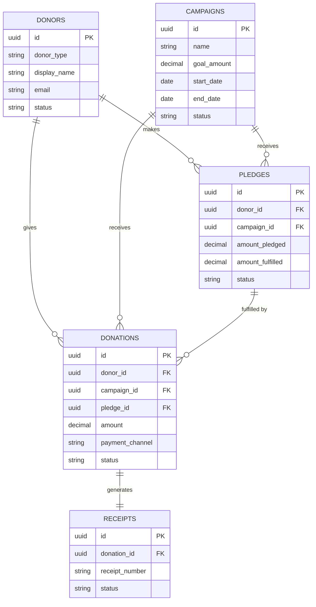

# ERD.md — Donation Management System

## Scope
v1 covers 5 entities: **Donor → Pledge / Donation → Receipt**, grouped by **Campaign**.
`organizations` and `users` are platform-level (owned by ARGO core) — shown only as FK references for tenant isolation and audit stamping, not created by this module.

## Standard Fields (on every table below, not repeated per-entity)
| Field | Type | Purpose |
|---|---|---|
| id | UUID | PK, server-generated |
| organization_id | UUID | FK → organizations.id — tenant isolation anchor |
| created_at / created_by | Timestamp / UUID | Stamped on insert |
| updated_at / updated_by | Timestamp / UUID | Stamped on update |
| deleted_at | Timestamp, nullable | Soft-delete flag |

---

## Diagram

*(All FK/PK fields include `organization_id` for tenant scoping — omitted above per-entity for readability; full list is in the Standard Fields table.)*

---

## Data Dictionary

### donors
*Anchor for who is giving — required for history, receipts, duplicate prevention.*

| Field | Type | Notes |
|---|---|---|
| donor_type | ENUM(`individual`,`organization`) | |
| display_name | VARCHAR(255) | Required |
| email | VARCHAR(255), nullable | Used for receipts |
| phone | VARCHAR(50), nullable | |
| address | TEXT, nullable | For receipts |
| status | ENUM(`active`,`inactive`), default `active` | |

**Constraint:** unique `(organization_id, email)` where email set and not deleted.

### campaigns
*Groups giving toward a goal — drives campaign-level reporting.*

| Field | Type | Notes |
|---|---|---|
| name | VARCHAR(255) | Required |
| description | TEXT, nullable | |
| goal_amount | DECIMAL(14,2) | Must be > 0 |
| start_date / end_date | DATE | end ≥ start if set |
| status | ENUM(`draft`,`active`,`closed`,`cancelled`), default `draft` | |

**Index:** `(organization_id, status)`.

### pledges
*Separates promised giving from received giving.*

| Field | Type | Notes |
|---|---|---|
| donor_id | UUID FK → donors.id | Required |
| campaign_id | UUID FK → campaigns.id, nullable | Null = undesignated pledge |
| amount_pledged | DECIMAL(14,2) | Must be > 0 |
| amount_fulfilled | DECIMAL(14,2), default 0 | **Server-maintained only** — recalculated from confirmed donations, never client-writable |
| status | ENUM(`pledged`,`partially_fulfilled`,`fulfilled`,`cancelled`) | Derived, stored for query speed |
| pledge_date / due_date | DATE | due_date nullable |

**Indexes:** `(organization_id, donor_id)`, `(organization_id, campaign_id)`, `(organization_id, status)`.

### donations — *vertical slice entity*
*The actual money-movement record; highest security/financial stakes.*

| Field | Type | Notes |
|---|---|---|
| donor_id | UUID FK → donors.id | Required |
| campaign_id | UUID FK → campaigns.id, nullable | |
| pledge_id | UUID FK → pledges.id, nullable | Must match donation's donor_id + organization_id |
| amount | DECIMAL(14,2) | Must be > 0 |
| payment_channel | ENUM(`cash`,`check`,`bank_transfer`,`card`,`online`,`other`) | Metadata only — no live gateway in v1 |
| payment_reference | VARCHAR(255), nullable | Free text (check #, txn ID) |
| donation_date | DATE | Required |
| status | ENUM(`pending`,`confirmed`,`refunded`,`void`), default `pending` | Only `confirmed` counts toward pledge fulfillment/reports |

**Constraint (app-layer):** if `pledge_id` set, `pledge.donor_id` must equal `donation.donor_id`, same `organization_id` — blocks IDOR via mismatched pledge reference.
**Indexes:** `(organization_id, donor_id)`, `(organization_id, campaign_id)`, `(organization_id, pledge_id)`, `(organization_id, status)`.

### receipts
*Proof of confirmed donation — separate lifecycle from the donation itself (void/reissue without touching the financial record).*

| Field | Type | Notes |
|---|---|---|
| donation_id | UUID FK → donations.id | **Unique** — one receipt per donation in v1 |
| receipt_number | VARCHAR(50) | Unique per organization |
| issued_at | Timestamp | Server-generated |
| issued_by | UUID | User/system that issued it |
| status | ENUM(`issued`,`voided`), default `issued` | |

**Constraints:** unique `(organization_id, receipt_number)`; unique `donation_id`.

---

## Soft-Deletion Strategy
All business tables use nullable `deleted_at`. No physical deletes for donors, campaigns, pledges, or donations — financial/donor records stay auditable. Default queries filter `WHERE deleted_at IS NULL`.

## Design Decision to Flag in Defense
`payment_channel` is an enum on `donations`, not a separate table — deliberate v1 scope choice since there's no live payment gateway integration yet. Likely becomes its own `payment_channels` table (per-org config, API keys) in v2.
