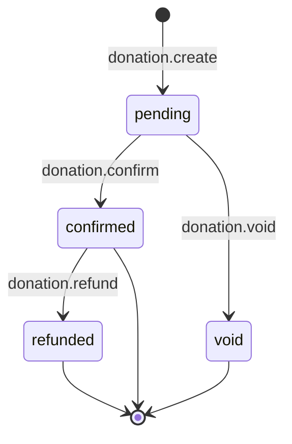
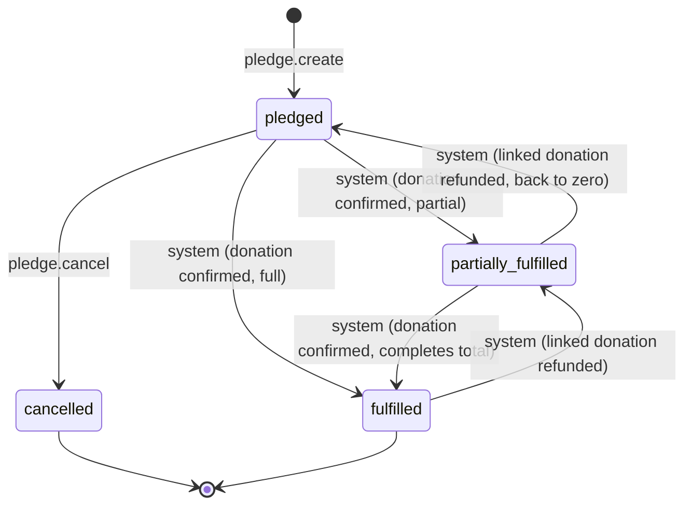
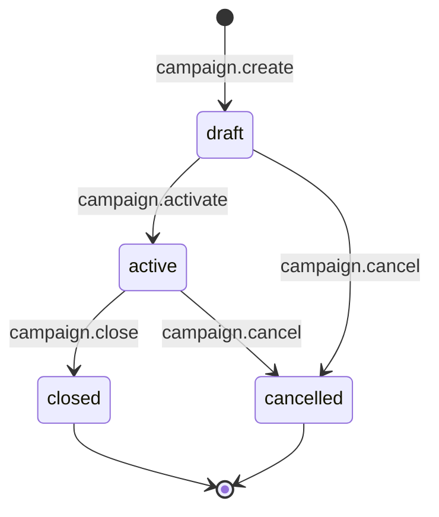

# WORKFLOW.md — Donation Management System

Three entities carry a lifecycle: **Donation** (core, vertical-slice entity), **Pledge**, and **Campaign**. Donation and Pledge are linked — a donation's transitions can cascade into automatic pledge recalculation.

---

## 1. Donation Lifecycle

### State-Transition Table

| Current State | Allowed Next State | Required Permission | Guard Condition | Actions Triggered |
|---|---|---|---|---|
| *(new)* | `pending` | `donation.create` | `donor_id` exists in org; `pledge_id` (if set) belongs to same donor/org; `amount > 0` | Record created, server-stamped |
| `pending` | `confirmed` | `donation.confirm` | Donation currently `pending` | Recalculate linked pledge `amount_fulfilled`/`status` (row-locked); auto-issue receipt — all in one transaction |
| `pending` | `void` | `donation.void` | Donation currently `pending` | None beyond status change (no pledge/receipt side effects, since nothing was ever fulfilled) |
| `confirmed` | `refunded` | `donation.refund` | Donation currently `confirmed` | Reverse linked pledge `amount_fulfilled`/`status` recalculation; void the associated receipt |

### Invalid Transitions (must be blocked, return `409`)
- `pending → refunded` — cannot refund something never confirmed; must `void` instead.
- `confirmed → void` — cannot void a confirmed donation; must `refund` instead (preserves the audit trail of money having moved).
- `void → confirmed` / `void → refunded` — void is terminal.
- `refunded → confirmed` / `refunded → void` — refunded is terminal.
- Any direct client write to `status` outside these transition endpoints — there is no `PATCH` for donation status; it only changes via `/confirm`, `/void`, `/refund`.

---

## 2. Pledge Lifecycle

### State-Transition Table

| Current State | Allowed Next State | Required Permission | Guard Condition | Actions Triggered |
|---|---|---|---|---|
| *(new)* | `pledged` | `pledge.create` | `donor_id` exists in org; `amount_pledged > 0` | `amount_fulfilled` initialized to `0` |
| `pledged` | `partially_fulfilled` / `fulfilled` | *(system, no direct client permission)* | Triggered only inside `donation.confirm` transaction | `amount_fulfilled` recalculated from sum of `confirmed` donations linked to this pledge |
| `partially_fulfilled` | `fulfilled` | *(system)* | Sum of confirmed linked donations reaches `amount_pledged` | Same recalculation |
| `fulfilled` / `partially_fulfilled` | (lower state) | *(system)* | Triggered only inside `donation.refund` transaction | `amount_fulfilled` recalculated downward |
| `pledged` | `cancelled` | `pledge.cancel` | No `confirmed` donations currently linked to this pledge | Pledge marked terminal; existing `pending` donations linked to it remain valid but orphaned from an active pledge (their `pledge_id` stays for history, but confirming them would need to be caught by the guard below) |

### Invalid Transitions (must be blocked, return `409`)
- `partially_fulfilled → cancelled` / `fulfilled → cancelled` — a pledge with confirmed money against it cannot be cancelled outright; this is not a data-entry error the system should silently erase.
- `cancelled → *` / `fulfilled → *` (other than the refund-driven step-down) — both are effectively terminal for direct client action.
- Direct client write to `amount_fulfilled` or `status` via any pledge endpoint — not exposed on `PATCH /api/pledges/:id` at all (see API_CONTRACT.md).
- **Edge case to guard explicitly:** confirming a `pending` donation whose linked pledge is `cancelled` — `donation.confirm` must check the pledge's current status and reject with `409` if the pledge has since been cancelled, not just its existence.

---

## 3. Campaign Lifecycle

### State-Transition Table

| Current State | Allowed Next State | Required Permission | Guard Condition | Actions Triggered |
|---|---|---|---|---|
| *(new)* | `draft` | `campaign.create` | `goal_amount > 0`; `end_date >= start_date` if set | Status forced to `draft` regardless of input |
| `draft` | `active` | `campaign.activate` | Campaign currently `draft` | Campaign now accepts pledges/donations in reporting rollups |
| `draft` | `cancelled` | `campaign.cancel` | Campaign currently `draft` | Terminal — no financial records should exist yet at `draft` |
| `active` | `closed` | `campaign.close` | Campaign currently `active` | Campaign stops accepting *new* pledges/donations tagged to it; existing linked records are unaffected |
| `active` | `cancelled` | `campaign.cancel` | No `confirmed` donations linked to this campaign | Terminal |

### Invalid Transitions (must be blocked, return `409`)
- `closed → *` — closed is terminal; reopening requires creating a new campaign, not resurrecting the old one (preserves historical reporting integrity).
- `active → cancelled` when confirmed donations exist — same rationale as pledge cancellation: money already received against a campaign can't be quietly erased.
- `cancelled → *` — terminal.

> **Gap flagged from API_CONTRACT.md:** the campaign `cancelled` state was defined in the ERD's enum but `campaign.cancel` wasn't yet documented as an endpoint in the API Contract — only `activate` and `close` were. This workflow model surfaces that gap; the API Contract should be updated to add `POST /api/campaigns/:id/cancel` with permission `campaign.cancel` (same role scope as `campaign.close` — Manager/Administrator) before the vertical slice or full build.

---

## Cross-Entity Cascade Summary
This is the part most worth walking through in the technical defense, since it's where the three lifecycles actually interact:

1. `donation.confirm` → pledge recalculation (if linked) + receipt auto-issue — **one transaction**.
2. `donation.refund` → pledge recalculation (downward) + receipt void — **one transaction**.
3. Pledge/campaign status never changes from a direct client request except `create`/`cancel`/`activate`/`close` — fulfillment status is always system-derived from donation state, never independently settable, which is the same mass-assignment defense from THREAT_MODEL.md applied to workflow.
